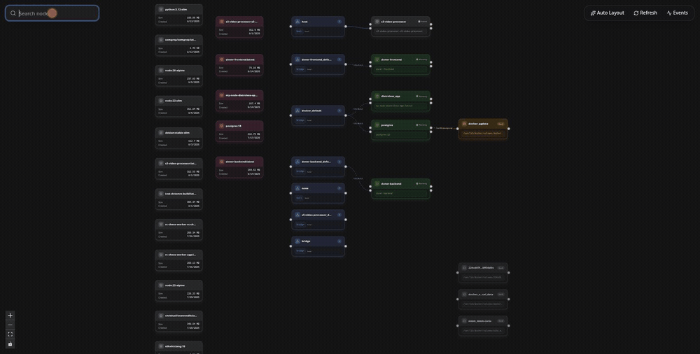
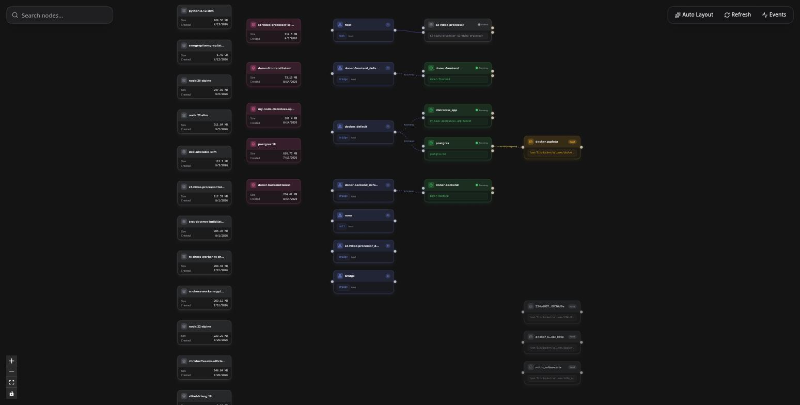
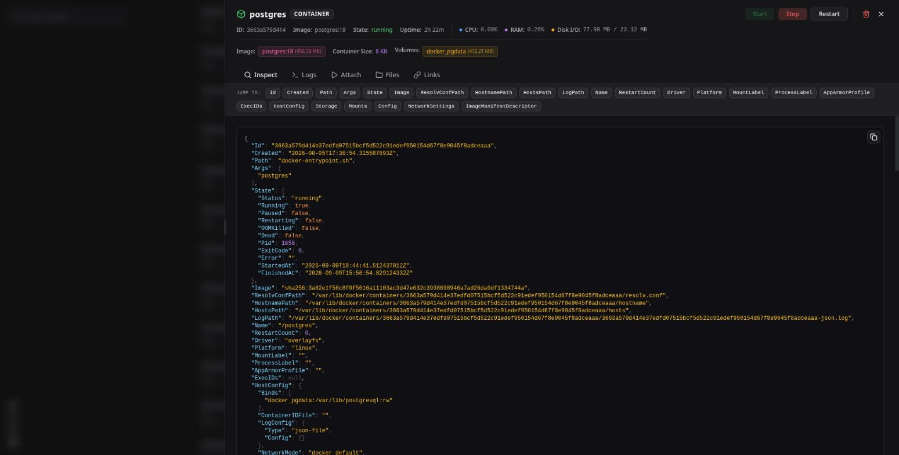
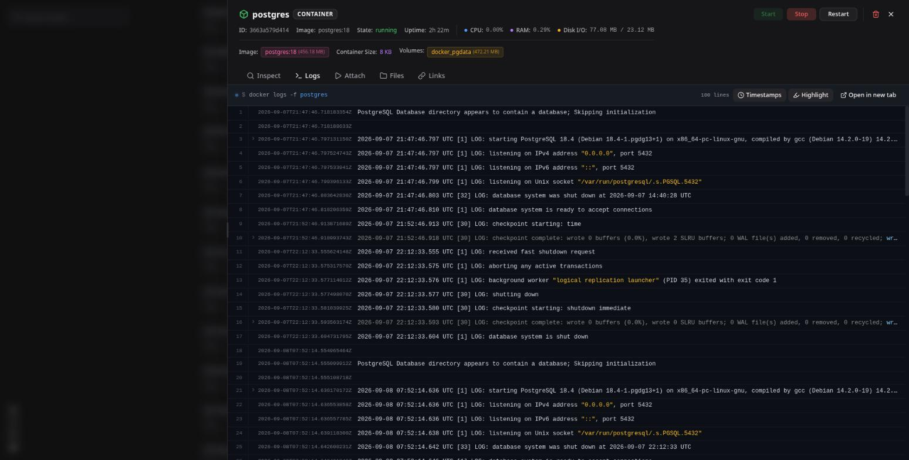
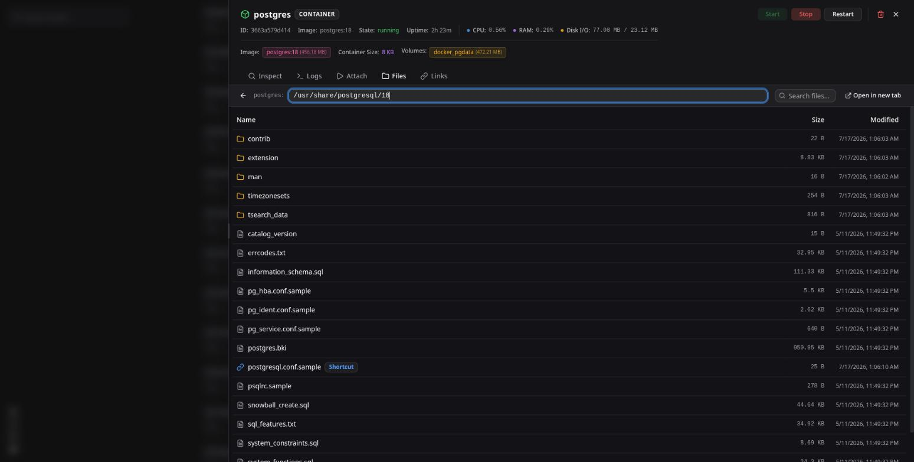
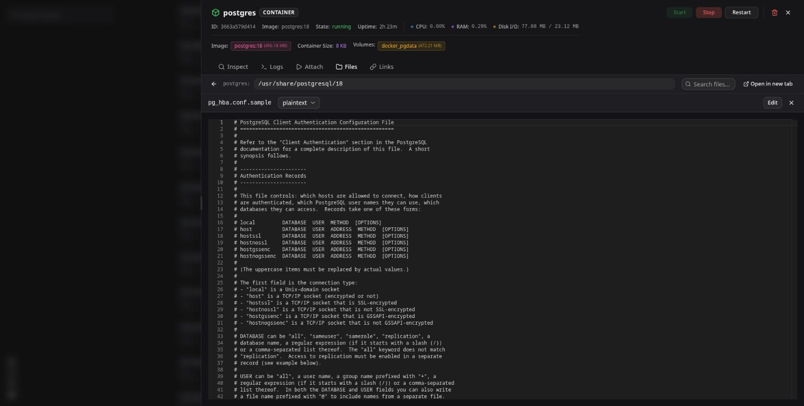
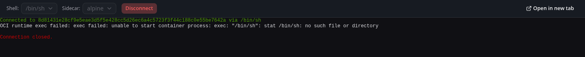
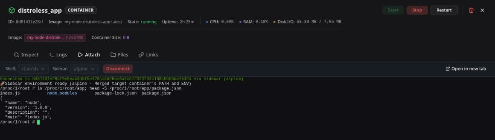

<h1 align="center">Doner</h1>

<p align="center">
  An interactive map of your Docker host — and a way to work inside it.
</p>

<p align="center">
  
  
  
  
  
</p>

<p align="center">
  
</p>

Doner reads your Docker daemon and draws it: images on the left, then networks,
containers, and the volumes they mount. Every node opens into a panel where you
can inspect it, follow its logs, browse and edit its files, or drop into a
shell — without leaving the browser.

---

## Contents

- [The graph](#the-graph)
- [What you can do with a container](#what-you-can-do-with-a-container)
- [Shells for containers that have none](#shells-for-containers-that-have-none)
- [Quick start](#quick-start)
- [Deployment](#deployment)
- [Security](#security)
- [API](#api)
- [Architecture](#architecture)
- [Development](#development)
- [License](#license)

---

## The graph



Four kinds of node, laid out in columns and aligned to what they connect to:

| Node | Shows | Colour |
|---|---|---|
| **Image** | repo tag, size, creation date | pink — dimmed when nothing uses it |
| **Network** | driver, scope, attached container count | indigo |
| **Container** | state, image, live status dot | green when running, grey when stopped, purple when it is one of Doner's own helpers |
| **Volume** | driver, mountpoint | amber — dimmed when nothing mounts it |

Edges carry the detail that usually needs a second command: the container's IP
on each network, and the destination path of every volume mount.

The layout is computed server-side, then remembered — drag a node and it stays
put across refreshes. **Auto Layout** discards those positions and re-derives
them. Hovering a node for a second dims everything it is not connected to;
`Ctrl`/`Cmd`+`F` jumps to the search box, which filters the graph as you type.

The graph refetches every 10 seconds, and immediately when the Docker event
stream reports a container starting, stopping, being created or destroyed.
**Events** opens a live feed of that stream.

## What you can do with a container

<table>
<tr>
<td width="50%"></td>
<td width="50%"></td>
</tr>
<tr>
<td><b>Inspect</b> — the full <code>docker inspect</code> payload, syntax highlighted, with a jump-to bar for its top-level keys. The header adds live CPU, memory and disk I/O, uptime, and image / writable-layer / volume sizes.</td>
<td><b>Logs</b> — a live tail with timestamps split out, JSON and logfmt highlighted, and error/warning lines tinted. Long lines expand on click. Toggle either off; scroll up to pause the follow.</td>
</tr>
<tr>
<td></td>
<td></td>
</tr>
<tr>
<td><b>Files</b> — browse the container's filesystem or a volume's contents. Mount points and symlinks are labelled. Right-click to rename, copy, paste, delete, or export a subtree as <code>.tar.gz</code>.</td>
<td><b>Editor</b> — open a file in Monaco, pick a language, edit and save it back into the container. Closing with unsaved changes asks first.</td>
</tr>
</table>

**Attach** gives an interactive shell over a WebSocket, **Links** stores
per-container bookmarks (a web UI, an admin port), and each of Logs, Files and
Attach opens in its own tab for a full-screen view.

Volumes get Inspect and Files. Networks and images get Inspect. Anything can be
deleted, behind a two-step confirmation with an optional force flag.

## Shells for containers that have none

Distroless and scratch images ship no shell, so the usual move fails:



Doner can instead start a throwaway **sidecar** that joins the target's PID and
network namespaces. The target's filesystem appears at `/proc/1/root`, and a
bootstrap script copies the target's `PATH` and environment into the sidecar so
your usual commands and variables resolve:



The sidecar is removed as soon as you disconnect.

## Quick start

**Requirements** — [Node.js](https://nodejs.org) ≥ 22, [pnpm](https://pnpm.io)
(via `corepack enable`), and a running Docker daemon whose socket you can read.

```bash
pnpm install:all   # installs root, backend and frontend
pnpm start         # backend on :3000, frontend on :5173
```

Open <http://localhost:5173>.

The frontend needs to know where the API lives. It is baked in at build time
from `VITE_API_URL`, which defaults to `http://localhost:3000`:

```bash
# frontend/.env
VITE_API_URL=http://localhost:3000
```

The backend takes `PORT` (default `3000`) and talks to Docker through the
default socket.

## Deployment

Each side has a Dockerfile and a compose file. The backend mounts the Docker
socket; the frontend builds to static files served by Nginx.

```bash
cd backend  && docker compose up --build -d
cd frontend && docker compose up --build -d
```

The committed compose files carry the network and addresses of one particular
host. Copy them to `docker-compose-local.yaml` (already gitignored) and adjust
`networks`, the static IPs, and the frontend's `VITE_API_URL` build arg to
match yours.

`.woodpecker/push.yaml` rebuilds whichever side changed on push and reports the
result to a webhook — useful as a starting point, specific to that same host.

## Security

**Doner has no authentication, and its API allows any origin.** Anyone who can
reach the backend can start, stop and delete your containers, read and write
files anywhere inside them, and open a root shell in any of them. The sidecar
and file-browser helpers run privileged and share the target's PID namespace.

The backend needs `/var/run/docker.sock`, so all of that is equivalent to root
on the host. Treat the API as a control plane, not a web app:

- Bind it to localhost, a VPN, or a private network — never a public interface.
- Put an authenticating reverse proxy in front of it if more than one person
  needs access.
- Anyone who can reach the frontend can reach the backend; the frontend calls
  the API directly from the browser.

Client-supplied paths are normalised before use and shell arguments are passed
positionally rather than interpolated, so a path cannot escape the volume or
container root it belongs to. That hardening protects the boundary between
resources — it is not a substitute for keeping the API off the open internet.

## API

REST under `/api`, three Server-Sent Event streams, and one WebSocket.
`:type` is one of `containerNode`, `networkNode`, `volumeNode`, `imageNode`;
`:scope` is `containers` or `volumes`.

### Topology

| Method | Endpoint | |
|---|---|---|
| `GET` | `/health` | liveness |
| `GET` | `/api/network-graph` | nodes and edges for the whole host |
| `GET` | `/api/system/df` | image, container and volume disk usage |
| `GET` | `/api/inspect/:type/:id` | raw inspect payload |
| `DELETE` | `/api/delete/:type/:id?force=` | remove a resource |

### Containers

| Method | Endpoint | |
|---|---|---|
| `POST` | `/api/containers/:id/start` · `/stop` · `/restart` | lifecycle |
| `GET` `POST` | `/api/containers/:id/links` | saved bookmarks |

### Files — containers and volumes share this shape

| Method | Endpoint | |
|---|---|---|
| `GET` | `/api/:scope/:id/files?path=` | list a directory |
| `GET` | `/api/:scope/:id/files/read?path=` | read a file (first 1 MB) |
| `POST` | `/api/:scope/:id/files/write?path=` | write a file |
| `POST` | `/api/:scope/:id/files/mkdir?path=` | create a directory |
| `POST` | `/api/:scope/:id/files/delete?path=` | delete recursively |
| `POST` | `/api/:scope/:id/files/copy` · `/rename` | `{ srcPath, destPath }` |
| `GET` | `/api/:scope/:id/export?path=` | download a `.tar.gz` |

### Streams

| Protocol | Endpoint | |
|---|---|---|
| SSE | `/api/container-logs/:id` | live log lines, last 100 first |
| SSE | `/api/container-stats/:id` | raw Docker stats samples |
| SSE | `/api/events` | the Docker event stream |
| WS | `/api/attach?containerId=&shell=&sidecar=&sidecarImage=` | interactive terminal |

<details>
<summary><code>GET /api/network-graph</code> — response shape</summary>

```json
{
  "nodes": [
    {
      "id": "net-27790aa75d00…",
      "type": "networkNode",
      "data": { "label": "bridge", "driver": "bridge", "scope": "local", "count": 3 },
      "position": { "x": 0, "y": 1080 }
    },
    {
      "id": "cont-dbb7e1124e64…",
      "type": "containerNode",
      "data": {
        "label": "s3-video-processor",
        "state": "exited",
        "image": "s3-video-processor",
        "mounts": [],
        "isInternal": false
      },
      "position": { "x": 420, "y": 0 }
    },
    {
      "id": "vol-224cd97f4423…",
      "type": "volumeNode",
      "data": {
        "label": "224cd97f4423…",
        "driver": "local",
        "mountpoint": "/var/lib/docker/volumes/224cd97f4423…/_data",
        "isUsed": false
      },
      "position": { "x": 880, "y": 1360 }
    },
    {
      "id": "img-sha256:8ec3590476e0…",
      "type": "imageNode",
      "data": {
        "label": "doner-backend:latest",
        "size": 277474500,
        "created": 1786660954,
        "isUsed": true
      },
      "position": { "x": -400, "y": 940 }
    }
  ],
  "edges": [
    {
      "id": "edge-cont-e911f0fda04f…-net-8f326ca15796…",
      "source": "cont-e911f0fda04f…",
      "sourceHandle": "net-out",
      "target": "net-8f326ca15796…",
      "animated": true,
      "label": "172.21.0.2",
      "style": { "stroke": "#6366f1" },
      "labelStyle": { "fill": "#a5b4fc", "fontSize": 10 }
    }
  ]
}
```

</details>

## Architecture

```
┌──────────────────────┐   REST · SSE · WS   ┌──────────────────────┐
│  Frontend            │ ──────────────────► │  Backend             │
│  React 19 + Vite     │                     │  NestJS + dockerode  │
│  React Flow · xterm  │ ◄────────────────── │                      │
│  Monaco · Tailwind   │                     └──────────┬───────────┘
└──────────────────────┘                                │
                                                docker.sock
                                                        │
                                     ┌──────────────────┴──────────────────┐
                                     │  containers · volumes · networks    │
                                     │  images · events                    │
                                     └──────────────────┬──────────────────┘
                                                        │
                                        alpine helper / sidecar container
                                     (mounts the volume, or joins the target's
                                      PID namespace to reach its filesystem)
```

Reading a volume or a container's files needs a process that can see them, so
the backend starts a small `alpine` container for the job: bind-mounted to the
volume, or sharing the target's PID namespace so its root shows up at
`/proc/1/root`. Helpers are pooled per target, reused across requests, and
reaped after two minutes idle.

`backend/src` is organised by feature — `topology`, `containers`, `files`,
`streams`, `attach` — over a shared `client` that owns the dockerode handle and
the helper pool. Volumes and containers expose the same file API from one base
class that differs only in its root path.

## Development

```bash
cd backend  && pnpm dev      # nest start --watch
cd frontend && pnpm dev      # vite

pnpm lint                    # biome, across every workspace
pnpm knip                    # unused files, exports and dependencies
```

Backend and frontend are independent pnpm projects; the root scripts install
and run both. Commits go through Biome via lint-staged and a build of whichever
side changed.

| | |
|---|---|
| **Backend** | NestJS 11, dockerode, `ws`, Server-Sent Events |
| **Frontend** | React 19, Vite, React Flow, Tailwind CSS v4, Base UI / shadcn, Monaco, xterm.js, TanStack Query, Axios |
| **Tooling** | pnpm, Biome, Knip, Husky, Woodpecker CI |

## License

[MIT](LICENSE)
